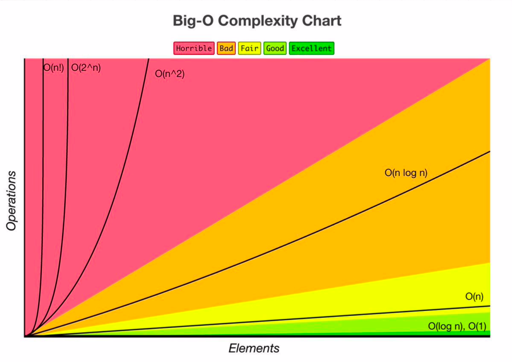

# Big O's

**`O(1)` Constant** - no loops

**`O(n)` Linear** - for loops, while loops through `n` items

**`O(n^2)` Quadratic** - every element in a collection needs to be compared to every other element. Two nested loops

**`O(log N)` Logarithmic** - usually _searching algorithms_ have `log n` if they are sorted (e.g.Binary Search)

**`O(n*log(n))` Log Linear** - usually _sorting operations_

**`O(2^n)` Exponential** - _recursive_ algorithms that solve a problem of size N

**`O(n!)` Factorial** - you are adding a loop for every element  

<p align="left">
  <a href="https://www.bigocheatsheet.com/" target="_blank">
    
  </a>
  <br>
  Source: <a href="https://www.bigocheatsheet.com/" target="_blank">https://www.bigocheatsheet.com/</a>
</p>  
 

|Big O|Name|Description|
| --- | --- | --- |
|1|Constant|statement, one line of code|
|log(n)|Logarithmic|Divide and conquer (binary search)|
|n|Linear|Loop|
|n*log(n)|Linearithmic|Effective sorting algorithms|
|n^2|Quadratic|Double loop|
|n^3|Cubic|Triple loop|
|2^n|Exponential|Complex full search|

## Rule Book  

**Rule 1:** Big O always cares about the **worst-case** scenario

**Rule 2:** Remove Constants

Example:  
```js
// BIG O (3 + 2n) = BIG O (n)
```

**Rule 3:**

- Different inputs should have different variables: `O(a + b)`.
- A and B arrays nested would be: `O(a * b)`  

    \+ for steps in order

    \* for nested steps  

Example:  
```js
function compressBoxesTwice(boxes, boxes2) {
    boxes.forEach((box)=> {
        console.log(box)
    })

    boxes2.forEach((box)=> {
        console.log(box)
    })
}

// O(n + n)

function compressBoxesTwice(boxes, boxes2) {
    boxes.forEach((box)=> {
        boxes2.forEach((box)=> {
            console.log(box)
        })
    })

}
// O(n * n) = O(n^2)
```

**Rule 4:** Drop Non-dominant terms  
Example:  
```js
// O(n^2 + 100 + n/2) = O(n^2)
```

## What Can Cause Time in a Function?  

Operations `(+,-, \*, /)`  
Comparisons `(<, >, ===)`  
Looping `(for, while)`  
Outside Function call `(function())`

## What Causes Space Complexity?  

- Variables
- Data Structures
- Function Call
- Allocations

## Sorting Algorithms  

|Sorting Algorithms|Space complexity|Time complexity|Time complexity|
| --- | --- | --- | --- |
|  | Worst case|Best case|Worst case|
|Insertion Sort|O(1)|O(n)|O(n^2)|
|Selection Sort|O(1)|O(n^2)|O(n^2)|
|Bubble Sort|O(1)|O(n)|O(n^2)|
|Mergesort|O(n)|O(n log n)|O(n log n)|
|Quicksort|O(log n)|O(n log n)|O(n^2)|
|Heapsort|O(1)|O(n log n)|O(n log n)|

## Common Data Structure Operations  

|Worst Case|Access|Search|Insertion|Deletion|Space Complexity|
| --- | --- | --- | --- | --- | --- |
|Array|O(1)|O(n)|O(n)|O(n)|O(n)|
|Stack|O(n)|O(n)|O(1)|O(1)|O(n)|
|Queue|O(n)|O(n)|O(1)|O(1)|O(n)|
|Singly-Linked List|O(n)|O(n)|O(1)|O(1)|O(n)|
|Doubly-Linked List|O(n)|O(n)|O(1)|O(1)|O(n)|
|Hash Table|N/A|O(n)|O(n)|O(n)|O(n)|


